# Supported Blocks

This is an exhaustive list of all supported and unsupported blocks.
If a block is missing from this list, or if a block has an incorrect
behavior which is not documented here, please open an issue.

Extensions which are not yet supported are not on this list.

Thanks to [scratchblocks](https://scratchblocks.github.io/) for generating these images.

## Motion

All motion blocks are fully supported.

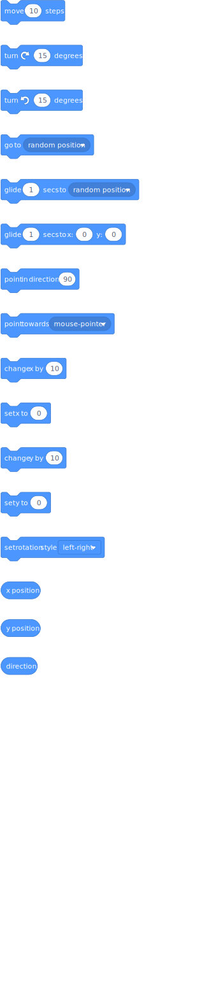

## Looks

### Speech bubbles

Looks speech bubble blocks are not yet supported. Text is instead printed to the console window. Speech blocks with a delay will still wait for the correct amount of time.

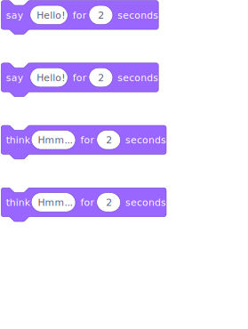

### Graphic effects

A limited number of graphic effects are functional. Currently, only the color, brightness, and ghost effect blocks work as expected. Clearing graphic effects also works correctly.

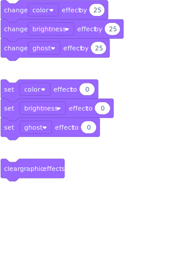

### Other looks

All other looks blocks are fully supported

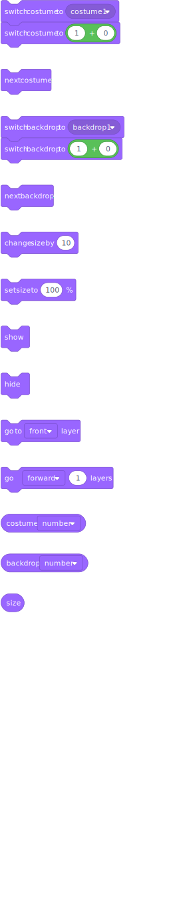

## Events

## When greater than

The when greater than block is not full implemented. In particular, the microphone is not supported so when loudness is greater than
does not work. The when timer greater than block might work as expected.

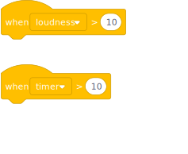

## Other events

All other event blocks are supported. Note that there are some edge cases where events will run in a different order than expected. Most projects will run correctly, but some which rely on Scratch to order events in a very specific way may have issues.

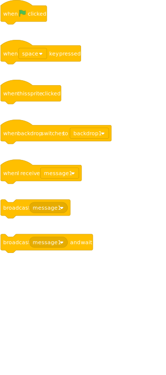

## Control

All control blocks are fully supported.

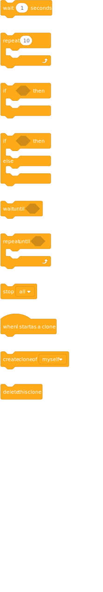

## Sensing

### Touching color

The sensing color blocks do not yet work, but they should be added
in the future.

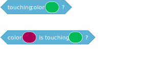

### Ask blocks

The sensing ask blocks do not yet fully work. Using them will show
a prompt in the console window, which will hang the program.

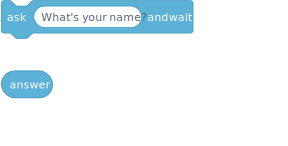

### Drag blocks

Sprite dragging not implemented, so the set drag mode block does not work.

### Sensing loudness

The microphone does not work, so the loudness sensing block does
not report loudness.

### Other sensing

All other sensing blocks are fully implemented.

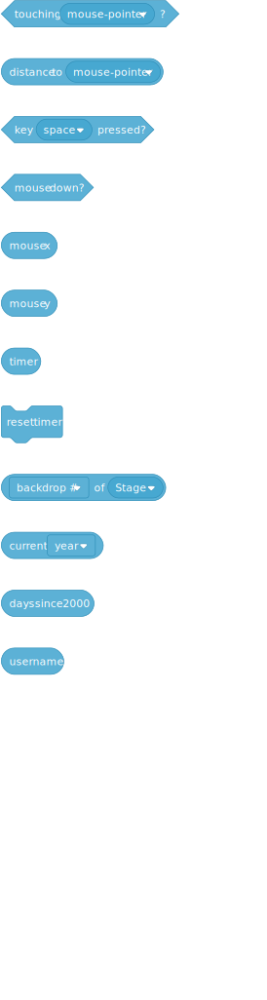

## Operators

All operator blocks are fully implemented.

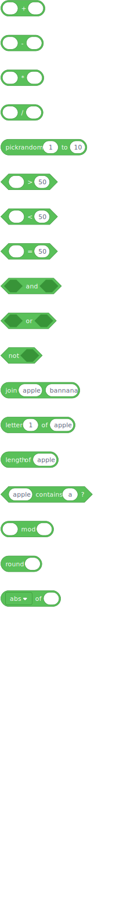

## Variables

### Variable monitors

Variable monitors are not yet supported. Using the show block on
a variable will print its current value to the console, however.

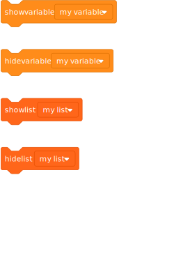

### Other variables

All other variable and list blocks are fully implemented.

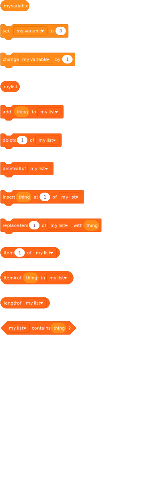

## Custom blocks

Custom blocks with arguments and with "run without screen refresh"
are fully implemented.

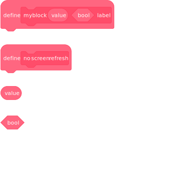

## Pen

All pen blocks are fully implemented. Note that the pen does not always
draw exactly as expected, so there may be a few differences. A few
glitches with the pen clipping on the screen have also been observed.

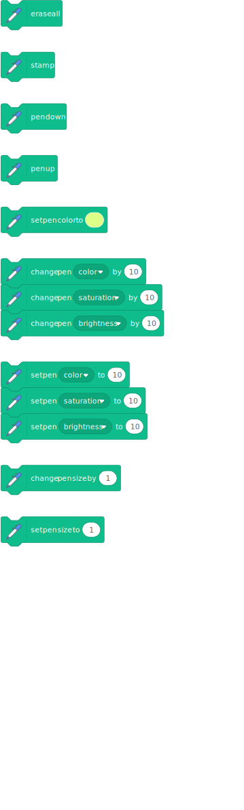

## Hidden blocks

Some hidden blocks are supported and act as expected. Notably, the `all at once` block
functions and runs its contents without screen refresh.

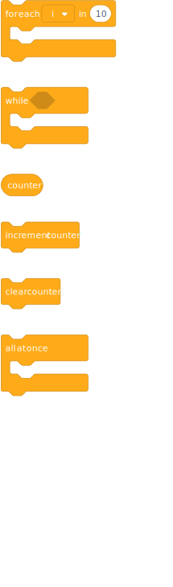
